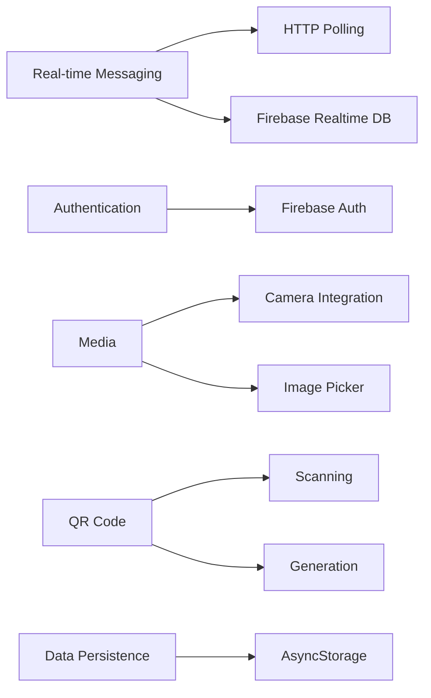

<div align="center">
  <h1>💬 LumeChat</h1>
  
  <p>A feature-rich real-time messaging application built with React Native & Expo</p>

  [](https://reactnative.dev/)
  [](https://expo.dev/)
  [](LICENSE)
  
</div>

## 📚 Documentation & Resources

### Design Resources
- [UI Design in Figma](https://www.figma.com/design/VHODYQtosegY59yzWkJ51W/Untitled?node-id=0-1&t=WLLkxyebUHPN7iYF-1) - Complete UI/UX design mockups and components
- [Database Diagram](https://lucid.app/lucidchart/fd23075e-98f7-4a7c-9257-7c0aefc32965/edit?viewport_loc=329%2C1411%2C6798%2C3171%2C0_0&invitationId=inv_c42994f3-63c5-421d-acd9-04614472316e) - Entity relationship diagrams and database architecture
- [API Documentation](https://lumechat.stoplight.io/docs/lumechat/symtd7da5glco-lumechat-api) - Complete REST API reference and endpoints

### App Download
📲 **Current development build**: [Download Development Build](https://expo.dev/accounts/rasmus_kaikkonen/projects/MessagingApp/builds/32798ccd-cd7c-4400-901a-6bf5e7ed85d8)

## ✨ Overview

LumeChat is a modern messaging platform that brings people together through seamless communication. Whether through direct messages or channel-based conversations, LumeChat provides a rich, intuitive experience with real-time updates and smart features.

## 📱 Features

<details open>
<summary><b>Authentication</b></summary>
<br>

- 🔐 User registration and login
- 👤 Profile creation and customization
- 🔄 Password recovery
</details>

<details open>
<summary><b>Messaging</b></summary>
<br>

- ⚡ Real-time direct messaging between users
- 👥 Channel-based group conversations
- ✓ Message status indicators (sent, delivered, read)
- 🎨 Message formatting and emoji support
</details>

<details open>
<summary><b>Channels</b></summary>
<br>

- 🌐 Public and private channels
- ⚙️ Channel creation and management
- 👑 User roles and permissions (admin, moderator, member)
- 🔗 Channel invitations via QR codes and links
</details>

<details>
<summary><b>Social Features</b></summary>
<br>

- 👋 Friend requests and contacts management
- 🟢 User status updates (online, away, offline)
- 🖼️ User profiles with customizable statuses
- 📱 QR code sharing for adding friends
</details>

<details>
<summary><b>Notifications</b></summary>
<br>

- 🔔 Push notifications for new messages
- 👤 Friend request notifications
- 📨 Channel invitation alerts
- ⚙️ Notification preferences
</details>

<details>
<summary><b>AI Integration</b></summary>
<br>

- 🤖 AI chatbot assistant
- 💬 Smart responses suggestions
- 🛡️ Content moderation
</details>

<details>
<summary><b>UI/UX</b></summary>
<br>

- 🎨 Modern Discord-inspired UI
- 🌙 Dark theme
- 📱 Responsive design that works on multiple device sizes
- ✨ Smooth animations and transitions
</details>

## 🛠️ Technical Overview

### Core Technologies

| Technology | Purpose |
|------------|---------|
| ⚛️ React Native & Expo | Frontend Framework |
| 🔄 Redux | State Management |
| 🧩 React Native Paper | UI Components |
| 🧭 React Navigation | Routing & Navigation |
| 🎨 StyleSheet & Linear Gradients | Styling |
| ☁️ Firebase | Authentication & Database |

**Backend URL**: https://lumechatapp.up.railway.app

### Key Features Implementation



## 🚀 Getting Started

### Prerequisites

- ✅ Node.js (v14 or later)
- ✅ npm or yarn
- ✅ Expo CLI
- ✅ Android Studio or Xcode (for native builds)

### Installation

1. **Clone the repository:**
```bash
git clone https://github.com/Mobile-Development-Project-GR-32/LumeChat-app.git
cd LumeChat-app
```

2. **Install dependencies:**
```bash
npm install
# or
yarn install
```

3. **Configure environment variables:**
   
   Create a `.env` file in the root directory with the following variables:

```env
# Firebase Configuration
FIREBASE_API_KEY=your_firebase_api_key
FIREBASE_AUTH_DOMAIN=your_firebase_auth_domain
FIREBASE_PROJECT_ID=your_firebase_project_id
FIREBASE_STORAGE_BUCKET=your_firebase_storage_bucket
FIREBASE_MESSAGING_SENDER_ID=your_firebase_messaging_sender_id
FIREBASE_APP_ID=your_firebase_app_id
FIREBASE_MEASUREMENT_ID=your_firebase_measurement_id

# Backend API
API_URL=https://lumechatapp.up.railway.app/api

# Stream API (for video calls)
STREAM_API_KEY=your_stream_api_key
CLIENT_API_SECRET=your_stream_api_secret
```

4. **Start the development server:**
```bash
npx expo start
```

5. **Run on a device or emulator:**
   - Press `a` to run on Android emulator
   - Press `i` to run on iOS simulator
   - Scan the QR code with your device to connect the dev build with the development server

## 🔒 Authentication

LumeChat uses Firebase authentication with session persistence through AsyncStorage, allowing users to stay logged in between app restarts.

## 📱 App Structure

```
LumeChat
├── 📂 assets          # Images, fonts and static assets
├── 📂 components      # Reusable UI components
├── 📂 navigation      # Navigation configuration
├── 📂 screens         # Application screens
├── 📂 services        # API and service integrations
├── 📂 store           # Redux store configuration
├── 📂 styles          # Global styles
└── 📂 utils           # Utility functions
```

### Key Screens

| Screen | Description |
|--------|-------------|
| 🔑 LoginScreen | User authentication |
| 📝 SignUpScreen | New user registration |
| 🏠 HomeScreen | Main navigation hub |
| 👥 ChannelChatScreen | Group messaging |
| 💬 DirectMessagesScreen | Private messaging |
| ⚙️ SettingsScreen | App configuration |
| 👤 ProfileScreen | User profile management |
| 🔔 Notifications_Screen | Notification center |
| 👥 ChannelProfileScreen | Channel management |
| 🤖 ChatbotScreen | AI assistant interface |

## 🧩 State Management

LumeChat uses Redux for global state management:

- 🔐 User authentication state
- 💬 Active conversations
- 🔔 Notification counts
- ⚙️ App preferences

## 🤝 Contributing

Contributions are welcome! Please feel free to submit a Pull Request.

## 📝 License

This project is licensed under the MIT License - see the [LICENSE](LICENSE) file for details.

## ✨ Acknowledgements

- [Expo](https://expo.dev/)
- [React Native](https://reactnative.dev/)
- [React Navigation](https://reactnavigation.org/)
- [Redux](https://redux.js.org/)
